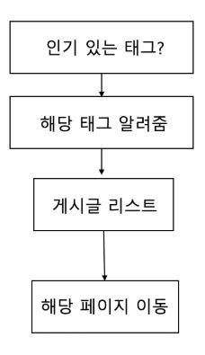

2019-1-OSSP2-Myway-1
====================

프로젝트명
----------
소프트웨어 학과 (컴퓨터공학과, 멀티미디어공학과, 정보통신공학과) 학생을 위한 프로젝트 서포팅 앱 '붓다'

프로젝트 개요
------------
> 붓다가 학생들에게 조언을 해주고 아이디어를 준다는 컨셉으로 제작된 프로젝트 서포팅 앱

- 프로젝트 주제선정과 구현에 어려움을 느끼는 공대생에게 도움을 주고자 만든 앱!

- 우리 학교 학생들이 직접 수행한 프로젝트들을 정리해 놓은 게시글을 통해 주제 선정과 문제 해결 과정에서 도움을 얻자! 


팀원
---
```
2017112113 유소영 - 팀장, 태그별 분류, 세션 유지
2017112120 정유나 - 좋아요/스크랩 기능, 검색 기능
2017112142 하유진 - 채팅, 게시글 작성
2017112131 이민주 - 챗봇, 에러 해결
```
사용한 플랫폼
------------
아이오닉4, 파이어베이스, dialog flow


실행 방법
---------
```bash
$ git clone https://github.com/CSID-DGU/2019-1-OSSP2-Myway-1.git
$ cd 2019-1-OSSP2-Myway-1.git/support_pro
$ npm install --save-dev @angular-devkit/build-angular
```

```bash
$ ionic cordova run ios //ios용
$ ionic cordova run android //android용
```

애플리케이션 구성도
------------------


주요 기능
---------

### 1. 게시글 작성 (TAB3)
```
- 프로젝트를 진행했던 학생들이 직접 프로젝트에 대한 정보를 기록.
```
### 2. 태그별 게시글 분류 (TAB1)
```
- 작성한 게시글을 해시태그별로 분류하여 해시태그 이름과 해당하는 해시태그의 대표 사진, 게시글 수를 보여줌.
- 사용자가 프로젝트를 키워드를 통해 찾을 수 있도록 함.
```
### 3. 게시글 좋아요, 스크랩 (POST -> TAB5(mypage))
```
- 프로젝트 게시글을 확인할 수 있는 페이지에서 좋아요나 스크랩 버튼을 누르면 비어있던 하트, 별이 채워진다.
- 이는 내가 좋아요한 글, 스크랩한 글의 목록에 추가되고 마이페이지에서 확인할 수 있음.
```
### 4. 게시글 작성자와의 채팅 (POST -> TAB4(chatting))
```
- 게시글 확인 페이지에서 작성자의 아이디를 누르게 되면, 채팅을 할 수 있음. 
- 채팅하기를 누르면 작성자와 사용자의 1:1 채팅방이 생성되고 채팅 화면으로 바로 이동하게 됨.
- 게시글에 대한 추가적인 질문이 있는 경우, 채팅 기능을 통해 심층적인 대화를 통해 궁금증을 해소할 수 있음.
```
### 5. 챗봇 (붓다봇) (TAB2)
```
- 게시글 이외에 사용자가 궁금해하는 정보를 제공해주는 챗봇
- 현재 붓다봇에서 제공하는 다이얼로그 플로우는 아래와 같다.    
```
| 1. 과별 가장 인기 있는 게시물 | 2. 전공별 프로젝트 추천 | 3. 과별 게시글 개수 |
| :----------: | :----------: | :----------: |
|  |  |  |
| 4. 수업별 게시글 개수 | 5. 요즘 핫한 태그 | 6. 수업별 프로젝트 추천 |
| :----------: | :----------: | :----------: |
|  |  |  |
